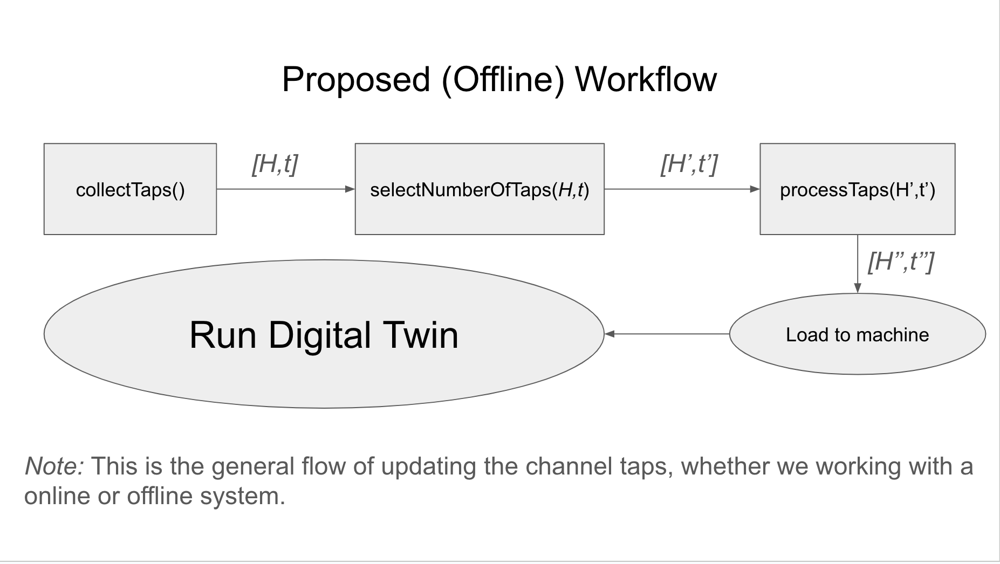

# Digital Twin Tracker - Pulak Mehrotra

A tracker used to both track my understanding of the topics I am implementing, as well as the results/progress of my implementations. I store all my results/code in this [Github Repository](https://github.com/ucsdwcsng/TinyTwin).

*Note:* This document contains a majority of my final findings. For a understanding of my thought process, please refer to my rough slides:
- [Wireless Slides](https://docs.google.com/presentation/d/1ZVRdaL4ylD1i6fVkltgcU_Vdj77Zs-Lg3jlwlW2bDhw/edit?usp=sharing)
- [Systems Slides](https://docs.google.com/presentation/d/15Sk_M7Azggf7XXFcFJ6bhrHNiq8MYJD5_OPluzeKJ3s/edit?usp=sharing)

## Overview

In this project, we attempt to create a cellular Digital Twin. Ushasi and I have categorized my efforts into two main areas: (1) *System Contributions* — creating a framework by building on top the existing open-source RAN stacks, and (2) *Wireless Contributions* — reducing a real-world channel into a format compatible with our Digital Twin framework.

### Proposed Workflow

<figure align="center">
    
    <figcaption>Channel Processing Workflow</figcaption>
</figure>

For a good estimate of a PHY channel, we have to ensure the following components are modeled/taken into account:

- Channel **changes rapidly over time**: update the channel taps periodically
- **Doppler effect**: should be taken care of by a appropriate temporal sampling of the channel
- **Spatial Aspects**: should be taken care of by simulating a MIMO system (MIMO systems are the ones mostly in use)

**Summary:**
1. **System Contributions:** 
    - We have an existing OAI Implementation with the option to plug channels of our choice.
    - Summary Slides : [[Slide 1](https://ucsdcloud-my.sharepoint.com/:p:/r/personal/dbharadia_ucsd_edu/Documents/WCSNG/People/Ushasi/Tiny-twin/tiny-twin.pptx?d=w397c362b2c664ac2b1091b1ca01ee699&csf=1&web=1&e=VkaUBd&nav=eyJzSWQiOjI2MywiY0lkIjoyNDA0NTEyNjkyfQ), [Slide 2](https://ucsdcloud-my.sharepoint.com/:p:/r/personal/dbharadia_ucsd_edu/Documents/WCSNG/People/Ushasi/Tiny-twin/tiny-twin.pptx?d=w397c362b2c664ac2b1091b1ca01ee699&csf=1&web=1&e=YMivXL&nav=eyJzSWQiOjI3OCwiY0lkIjoyNjgxNTM2MzMxfQ), [Slide 3](https://ucsdcloud-my.sharepoint.com/:p:/r/personal/dbharadia_ucsd_edu/Documents/WCSNG/People/Ushasi/Tiny-twin/tiny-twin.pptx?d=w397c362b2c664ac2b1091b1ca01ee699&csf=1&web=1&e=4VCK4R&nav=eyJzSWQiOjI4NCwiY0lkIjoxOTE3MDY4ODgxfQ)]

2. **Wireless Contributions:**
    - We have finalized a complete pipeline to represent a real-world, time-varying channel in a compute-intensive form that can be integrated into our existing OAI framework.
    - To summarise, I have created a short summary presentation you can refer to [this slide](https://ucsdcloud-my.sharepoint.com/:p:/r/personal/dbharadia_ucsd_edu/Documents/WCSNG/People/Ushasi/Tiny-twin/tiny-twin.pptx?d=w397c362b2c664ac2b1091b1ca01ee699&csf=1&web=1&e=chsHNL&nav=eyJzSWQiOjMxMSwiY0lkIjoyNDU0MDA3OTQ3fQ) onwards.

## Time-Wise Progress

A summary of my week-by-week progress.

### August 12th - August 20th
- Setup a [OFDM system](https://ucsdcloud-my.sharepoint.com/:p:/r/personal/dbharadia_ucsd_edu/Documents/WCSNG/People/Ushasi/Tiny-twin/tiny-twin.pptx?d=w397c362b2c664ac2b1091b1ca01ee699&csf=1&web=1&e=VI2Zs9&nav=eyJzSWQiOjI2NSwiY0lkIjo2MDM2NjI4MDZ9) in Sionna.
- Figured out how to port [our own scenes](https://github.com/ucsdwcsng/TinyTwin/blob/pulak/channel/ofdm_scenes/blr-scene-ofdm.ipynb) into Sionna using OSM -- used this to get CIRs and Channel Taps.

### August 21st - August 30th
- Started understanding the srsRAN codebase and observing how the [UE](https://github.com/ucsdwcsng/TinyTwin/blob/6c1673c12afb1e3c8e22cec523ac069eaf97a4b1/srsRAN_4G/lib/src/phy/rf/rf_zmq_imp_tx.c#L149) and [gNB's](https://github.com/ucsdwcsng/TinyTwin/blob/6c1673c12afb1e3c8e22cec523ac069eaf97a4b1/srsRAN_Project/lib/radio/zmq/radio_zmq_tx_channel.cpp#L184) ports are configured.
- Created many more such scenes in Sionna, using the pre-existing Sionna scenes: [Munich](https://github.com/ucsdwcsng/TinyTwin/blob/pulak/channel/ofdm_scenes/munich-v1-scene.ipynb) and [Etoile](https://github.com/ucsdwcsng/TinyTwin/blob/pulak/channel/ofdm_scenes/etoile-scene.ipynb).
- Started plotting [CIRs](https://github.com/ucsdwcsng/TinyTwin/tree/pulak/channel/plots/select_number_of_taps/cirs%2Bchannel_taps/tests) and [OFDM symbols](https://github.com/ucsdwcsng/TinyTwin/tree/pulak/channel/plots/select_number_of_taps/symbols/without_eq).
    - Aim was to get "good" CIRs -- Non-single tap CIRs.
    - Tried plotting [magnitude](https://github.com/ucsdwcsng/TinyTwin/tree/pulak/channel/plots/select_number_of_taps/los-etoile/power) and [phase change](https://github.com/ucsdwcsng/TinyTwin/blob/pulak/channel/plots/select_number_of_taps/los-etoile/phase/256qam.png) of OFDM output symbols for different channels.
        - **POOR METRIC**

### September 2nd - September 9th
- *Came to UCSD from India, most of the week went in setting up.*

### September 10th - September 24th
- Performed my old experiments but with EVM as the [main metric of significance](https://github.com/ucsdwcsng/TinyTwin/tree/pulak/channel/plots/select_number_of_taps/nlos-munich/new_algo).
- Performed many small experiments top get the correct ZMQ ports working. More details are available from [my ZMQ docs](https://github.com/ucsdwcsng/UCSD_Progress/blob/main/misc.md)).
- Figured out correct ZMQ port configirations -- was able to send and receive data without GRC.
- **Creating a pure C++ alternative to GRC is non-trivial.** Some components I will have to design:
    - Thread Scheduler
    - Multi-Thread Accessible Storage (RING) Buffer
    - Asynchronous Messaging System
- *Possible, but will take me time to do. Will attempt again after getting the OAI system up and running completely.*

### September 26th - November 5th
- Came up with a framework to perform Tap Reduction.
- Well documneted in slides from [here onwards](https://ucsdcloud-my.sharepoint.com/:p:/r/personal/dbharadia_ucsd_edu/Documents/WCSNG/People/Ushasi/Tiny-twin/tiny-twin.pptx?d=w397c362b2c664ac2b1091b1ca01ee699&csf=1&web=1&e=JZa8hb&nav=eyJzSWQiOjMwNSwiY0lkIjozMzIyOTQzNjUxfQ).

### November 6th - November 14th
- Plotted Delay-Doppler estimates.
- Revised OFDM theory.
- Performed [basic experiments for mobile scenarios]().

### November 15th - November 23rd
- *TRAVELLING*

### November 24th - December 1st
- Performed SVD to get path-wise delay and Doppler estimates.
- Performed Doppler Super-Resolution: Increase the FFT Size
- Plotted [more metrics](https://github.com/ucsdwcsng/TinyTwin/tree/pulak/channel/plots/when_to_update_taps/spatial/etoile-mobile) for temporal channel variation.
    - Plotted Mean Channel Power, Mean Squared Error, Earth Mover Distance and EVM.
    - EVM is still the best way to understand symbol variations.

### December 9th - December 21st
- Came to Phase-Shift as a good metric to model average phase shift across symbols.
- Finalising Channel Updation Pipeline with Ish and Ushasi.
    - Mapped extremely fine-grained metrics to fully understand what types of channel changes are significant. 
    - *Which metrics to use finally?*
- Wrote my thesis and submitted the same to BITS. 

### December 23rd - Present
- Recognised an issue in bounding the TTIs -- the timing overhead introduced by RF Simulator's convolution causes the TTI times of the system to balloon. 
- Problem and solution better explained [here](https://ucsdcloud-my.sharepoint.com/:p:/r/personal/dbharadia_ucsd_edu/Documents/WCSNG/People/Ushasi/Tiny-twin/tiny-twin.pptx?d=w397c362b2c664ac2b1091b1ca01ee699&csf=1&web=1&e=y25n77&nav=eyJzSWQiOjM1MiwiY0lkIjo5MTkwNzUzMTB9).

## Next Steps:
- Discuss tap reduction scenarios -- what datasets/Sionna scenarios to use
- Perform large-scale experiments for [tap reduction](https://ucsdcloud-my.sharepoint.com/:p:/r/personal/dbharadia_ucsd_edu/Documents/WCSNG/People/Ushasi/Tiny-twin/tiny-twin.pptx?d=w397c362b2c664ac2b1091b1ca01ee699&csf=1&web=1&e=SwZlmx&nav=eyJzSWQiOjMyNiwiY0lkIjozMTAwMDkzNzA1fQ) and [channel updation](https://ucsdcloud-my.sharepoint.com/:p:/r/personal/dbharadia_ucsd_edu/Documents/WCSNG/People/Ushasi/Tiny-twin/tiny-twin.pptx?d=w397c362b2c664ac2b1091b1ca01ee699&csf=1&web=1&e=K3PFja&nav=eyJzSWQiOjI5NCwiY0lkIjozNTI5Mzg5Mzk5fQ).
- **Ensure TTIs are ms bound**

