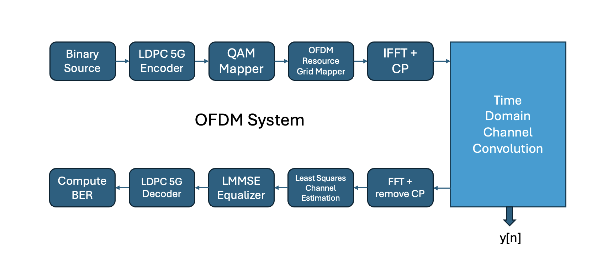

# Digital Twin Tracker - Pulak Mehrotra

A tracker used to both track my understanding of the topics I am implementing, as well as the results/progress of my implementations. I store all my results/code in this [Github Repository](https://github.com/ucsdwcsng/TinyTwin).

*Note:* This document contains a majority of my final findings. For a understanding of my thought process, please refer to my slides:
- [Wireless Slides](https://docs.google.com/presentation/d/1ZVRdaL4ylD1i6fVkltgcU_Vdj77Zs-Lg3jlwlW2bDhw/edit?usp=sharing)
- [Systems Slides](https://docs.google.com/presentation/d/15Sk_M7Azggf7XXFcFJ6bhrHNiq8MYJD5_OPluzeKJ3s/edit?usp=sharing)

## Overview

In this project, we attempt to create an easy-to-use, full-scale 5G Digital Twin. We attempt to build our solution on top of the following solutions:
- Open5GS (Core Network)
- srsRAN 5G/Project (gNB)
- srsUE (UEs)

The project can be broadly categorized into two primary components:
- [Wireless Efforts](https://github.com/ucsdwcsng/UCSD_Progress/blob/main/digital_twin_tracker.md#wireless-efforts): Involves identifying the most concise and least compute-intensive representation of channel taps.
- [Systems Efforts](https://github.com/ucsdwcsng/UCSD_Progress/blob/main/digital_twin_tracker.md#systems-efforts): Developing a ZMQ broker to replace GNU Radio Flowgraph usually used to connect the srsUE to the srsRAN Project's gNB.

## Wireless Efforts

For a good estimate of a PHY channel, we have to ensure the following components are modeled/taken into account:
- Channel changes rapidly over **time** : update the channel taps periodically
- **Doppler effect**: should be taken care of by a appropriate temporal sampling of the channel
- **Spatial Aspects**: should be taken care of by simulating a MIMO system (MIMO systems are the ones mostly in use)

*Note*: MIMO is down the road, we need to get a SISO system up and running with the above two considerations first.

### Proposed Workflow

<figure align="center">
    
    <figcaption>Channel Processing Workflow</figcaption>
</figure>

More Information:
- **collectTaps()**: 
    - The overarching idea which we develop our solution on top of is we can introduce abstraction into our data transmission by convolving the input with channel taps (channel taps are simply a discretely-sampled version of the CIR of a scene).
    - We can obtain such taps from various methods and run an accurate simulation of the environment for a given instant.
    - For now, we use Sionna to get channel representations and will move on to over-the-air experiments after this.

- **selectNumberOfTaps(H,t)**: 
    - Each system, no matter how big or small, will have a limit on the amount of sliding window convolutions it can perform in real time.
    - It is reasonable to assume that the channel representation will contain a higher resolution of taps than the system supports.
    - Here, we attempt to find the most succinct representation of the channel. More information [here](https://github.com/ucsdwcsng/UCSD_Progress/blob/main/digital_twin_tracker.md#experiments-performed).

- **processTaps(H',t')**:
    - This step will only be required if the number of taps we receive is still more than our system's capacity.
    - While initially perceived as essential, the necessity of this step appears to diminish following the previous one. The reason being, if we've already invested significant effort in identifying the most dominant taps, further reduction of these taps may not be a logical progression.
    - Old version of my proposed algorithm can be found [here](https://github.com/ucsdwcsng/UCSD_Progress/blob/main/documents/processTaps.pdf).

### Fundamentals Revision

Before performing experiments, I took some time revising some old coursework and other similar materials:
- [Wireless Communications by Prof. Aditya Jagannatham](https://www.youtube.com/playlist?list=PL30blqFldQN6N0PmEPr9vFUxOY0W0omg8)
- [Excellent OFDM Notes](https://www.eit.lth.se/fileadmin/eit/courses/ettn01/HT2-2017_Rusek/OFDM_lecture_notes_161115.pdf)
- Signals and Systems by Alan V. Oppenheim (Revise)
- Wireless Communications by Andrea Goldsmith (Revise)
- ECE 257b (Upto L6)

### Experiments Performed

Experiments perfromed in Sionna using the Docker container provided by the developers. You can find my code [here](https://github.com/ucsdwcsng/TinyTwin/tree/pulak/channel).

**Hypothesis**: 
- Selecting the first few strongest channel taps will be sufficient to satisfactorily model a channel.
- *How does this make sense?* The first few taps almost always include the LoS path as well as the strongest NLoS paths. Of course, there is the chance that the taps at the end are strong as well. The point of this experiments is to see if this distortion is significant.

**Experiments**:
Done over Sionna simulations for now. Will move to over-the-air when the above-mentioned workflow is in place.

- *Part 1: What did we implement?*
    - I had a existing scene from my old work on Sionna of a Blender model of the area around my house in Bangalore.
    - After plotting the CIR and taps we realised the channel has only one dominant tap (most likely LoS).
    - The low distance between the TX-RX pair as well as the low $D_{S}$ are the likely reasons for this.
    - We dropped the ending channel taps to get a reduced representation of the channel.
    - We then attempted to plot the deviation in phase and magnitude of the convolved product $y_{\text{REDUCED}}$ compared to $y_{\text{TRUTH}}$. 
- *Part 2: Can we generalise?*  
    - We collected CIRs from a few more scenes to see if such results (single dominant tap systems) track across Sionna at the very least. We will discuss about the results below.
    - Two pre-loaded scenes from the `rt` module in Sionna were the scenes in use:
        - Munich
        - Etoile 

<figure align="center">
    
    <figcaption>Setup a OFDM TX and RX in Sionna</figcaption>
</figure>

### Results

Metrics Considered:
- Moving Average of the Magnitude and Phase Difference in the convolved IQ (before decoding)
- MAPE (Mean Absolute Percentage Error) - Not of use actually. No good way to understand power differences in this case (atleast in the linear domain)

For the results, please refer to [my wireless slides](https://docs.google.com/presentation/d/1ZVRdaL4ylD1i6fVkltgcU_Vdj77Zs-Lg3jlwlW2bDhw/edit?usp=sharing) from slide 18 onwards. 
**[STILL UPLOADING PLOTS]**

### Next Steps

- See how other higher layer artifacts are affected by the changing the tap resolution.
- The next step after figuring out an appropriate tap resolution (for a given MCS) is to figure out when to update
    - Where mobility/Doppler comes into play

### TL;DR

Working on figuring an appropriate tap resolution for a given channel. Performing simulations/experiments in Sionna for now. Will move on to mobile scenarios after figuring out a succinct static channel representation.

## Systems Efforts

The best way to understand my progress in creating a ZMQ Broker that can perform real-time convolutions would be going through [my slides](https://docs.google.com/presentation/d/15Sk_M7Azggf7XXFcFJ6bhrHNiq8MYJD5_OPluzeKJ3s/edit?usp=sharing) from slide 9 onwards. A summary is below:

### GNU

If we are receiving data in the form of a stream, it might make more sense to perform sliding window convolutions on the IQ input.
- Is the data received as a stream though? --> It is not, it is receieved as blocks at the REQ sockets.
- A custom sliding window block in GNU did not give good results 
- More information on [Slides 15 and 16](https://docs.google.com/presentation/d/15Sk_M7Azggf7XXFcFJ6bhrHNiq8MYJD5_OPluzeKJ3s/edit?usp=sharing).

For more information on my initial experiments on figuring the best type of convolution to perform

### C++

As I was new to developing using ZeroMQ, I approached this step-by-step:
- First created programs that:
    - read from sockets (P1)
    - wrote to sockets (P2)
- Tried to put them together. Issues I ran into:
    - Asynchronous transmission necessitates a multi-threaded approach.
    - A data structure must store data and support multiple-thread access *at the same time.*

**New Approach [IN-PROGRESS] :**
- **Use GNU's approach to store data**
    - Effectively GNU has implemented a PUB-SUB pattern in REQ-REP.
    - For more information, refer to Slides 32-36.

### TL;DR
- Used the pre-existing FFT blocks to perform convolutions
    - Slow and non-scalable, but atleast the system started up (UE attached)
    - *Only setup that worked*
- Implemented a custom Sliding Convolution block as a C++ OOT Module
    - UE did not attach
    - Timeouts occured (**Please refer to slide 15**)
- Attempted (many times) to create a C++ flowgraph which does what GNU Radio's Flowgraph does
    - Classic queues cannot be used to store data in real time.
- Next Steps:
    - Implement what is implemented in the GNU Flowgraph's C++ flowgraph.
   

