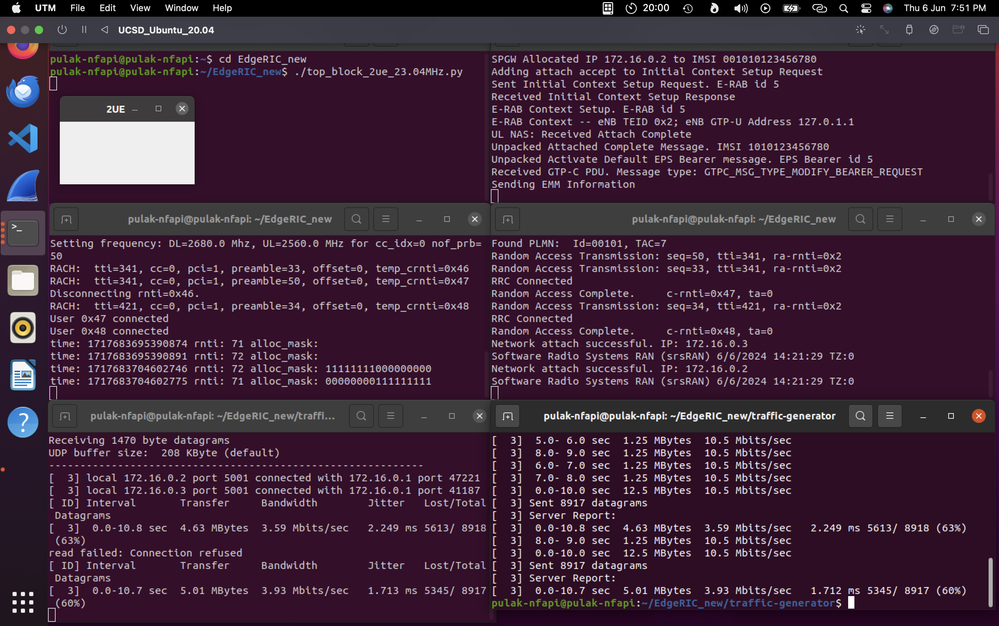
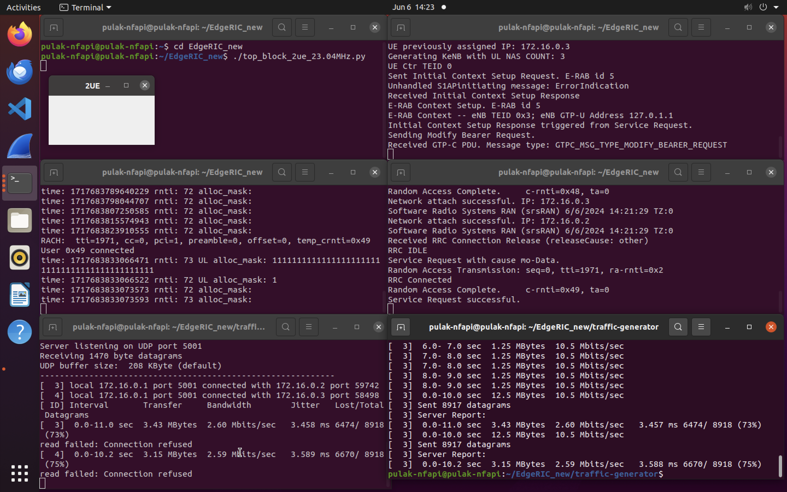
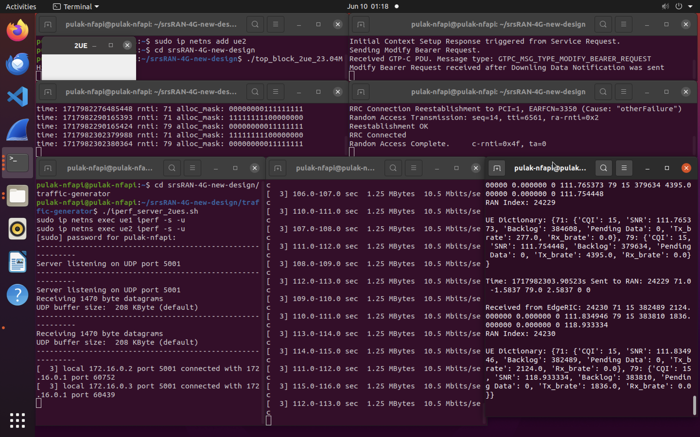
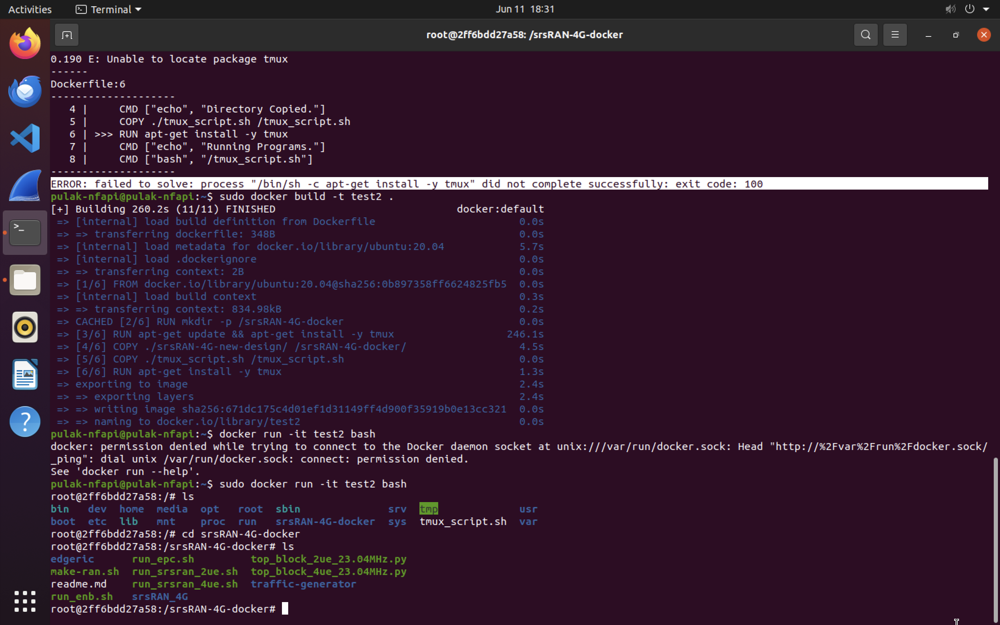

# μApps Project Tracker - Pulak Mehrotra

A tracker used to both track my understanding of the softwares I am implementing, as well as the results/progress of my implementations. I have also annotated the files I have run to gain a better understanding of the implementation.

## What Are μApps?

- μApps function as microservices for srsRAN stack, specifically for the O-DU, located on the Edge. They provide real-time monitoring and control of the RAN, as well as aggregate information from user applications.
- μApps utilize the RT-E2 protocol to implement real-time policies. These policies are executed using a version of `edgeric_messenger_new.py`. An annotated version of this file, along with my interpretations, can be found [here](https://github.com/pulak999/UCSD_Progress/blob/main/annotated_code/edgeric_messenger.py).
- Given the positioning of μApps for real-time control, we leverage this framework to execute downlink resource block allocation algorithms. The algorithms I used include:
    - Max CQI
    - Max Weight
    - RL Scheduler (for the fully trained model)
- The real-time schedulers subscribe to the RT-E2 Report service, which they use for inference and control.
- I have slightly modified the file used to implement the scheduling algorithms. This modification allows for the saving of cumulative throughput for a given Transmission Time Interval (TTI) to a CSV file. You can view this [file](https://github.com/pulak999/UCSD_Progress/blob/main/annotated_code/muApp1_run_DL_scheduling.py) and you can also view the [output from my implementation](https://github.com/pulak999/UCSD_Progress/blob/main/muapp_tracker.md#output).

## Code

1. **Terminal 1**

    Establish the GRC Broker between the UEs and the eNB using ZMQ Virtual Radios after ensuring a clean teardown and rebuild of the srsRAN stack.

    ```bash
    cd srsRAN-4G-new-design
    ./make-ran.sh
    ./top_block_2ue_23.04MHz.py
    ```

2. **Terminal 2**

    Update the epc.conf file and start the EPC.

    ```bash
    cd srsRAN-4G-new-design
    ./run_epc.sh
    ```

3. **Terminal 3**

    Update the enb.conf file and start the eNB.

    ```bash
    cd srsRAN-4G-new-design
    ./run_enb.sh
    ```

4. **Terminal 4**

    Run both UEs in the same terminal using the automated scripts.

    ```bash
    cd srsRAN-4G-new-design
    ./run_srsran_2ue.sh
    ```

6. **Traffic Generation**

    Used to generate DL Traffic to allow the scheduling algorithim to run.

    *Terminal 5 (Server)*

    ```bash
    cd srsRAN-4G-new-design/traffic-generator
    ./iperf_server_2ues.sh
    ```
    *Terminal 6 (Client)*
    
    ```bash
    cd srsRAN-4G-new-design/traffic-generator
    ./iperf_client_2ues.sh 10M 10M 1000
    ```

6. **Running μApps**

    Activate the PyTorch environment to run the RL model.

    ```bash
    cd ~/pytorch_env
    source pytorch_env/bin/activate
    ```
    
    Running the DL scheduler. 

    ```bash
    cd ..
    cd srsRAN-4G-new-design/edgeric/muApp1
    sudo python3 muApp1_run_DL_scheduling.py
    ```

    In the `muApp1_run_DL_scheduling.py` file, various algorithms are utilized for performance comparison. The desired scheduler should be specified within this file and executed separately.

## Containerizing The Application

### Background

- Docker is a containerization platform – it is a toolkit that allows you to build, deploy and manage applications.
- Containers provide a way of creating an isolated environment, sometimes called a sandbox, in which applications and their dependencies can run. They are considered *decoupled* from the environment in which they run.
- Containers ensure that an application will run the same way, regardless of where it is deployed. This is because all dependencies and configurations are included within the container.
- *Dockerfile* : A Dockerfile is a text document that contains all the commands you would normally execute manually in order to build a Docker image. Docker can build images automatically by reading the instructions from a Dockerfile.
- *Docker Image* : A Docker image is a file used to execute code in a Docker container. Docker images act as a set of instructions to build a Docker container, such as a template.
- Difference between a VM and a container:
    - VMs are created by virtualizing the host machine’s underlying hardware (processing, memory and disk). The available hardware is split up, with a piece representing a portion of the underlying physical hardware, which a VM can be run on.
    - Furthermore, since each VM is basically its own machine, they have their own OS installed, which typically require tens of gigabytes of storage, and which therefore takes time to install, which has to be done every time you want to spin up a new VM.
    - like VMs, containers live on top of a host machine and use its resources, however, instead of virtualizing the underlying hardware, they virtualize the host OS. Meaning containers don’t need to have their own OS, making them much more lightweight than VMs, and consequently quicker to spin up.
    - With containers, only the things that the app absolutely needs are copied into the container, as opposed to VMs were the whole OS is installed – even the things from the OS that aren’t used by the app.

### Installation

Installed the Docker Engine, Docker Compose and Docker CLI according to the instructions according to the [official Docker tutorial](https://docs.docker.com/desktop/install/ubuntu/).

```bash
# uninstall old versions
for pkg in docker.io docker-doc docker-compose docker-compose-v2 podman-docker containerd runc; do sudo apt-get remove $pkg; done

# adding Docker's official GPG key
sudo apt-get update
sudo apt-get install ca-certificates curl
sudo install -m 0755 -d /etc/apt/keyrings
sudo curl -fsSL https://download.docker.com/linux/ubuntu/gpg -o /etc/apt/keyrings/docker.asc
sudo chmod a+r /etc/apt/keyrings/docker.asc

# adding the apt repository
echo \
  "deb [arch=$(dpkg --print-architecture) signed-by=/etc/apt/keyrings/docker.asc] https://download.docker.com/linux/ubuntu \
  $(. /etc/os-release && echo "$VERSION_CODENAME") stable" | \
  sudo tee /etc/apt/sources.list.d/docker.list > /dev/null
sudo apt-get update

# install Docker engine
sudo apt-get install docker-ce docker-ce-cli containerd.io docker-buildx-plugin docker-compose-plugin 
```

### Creating A Docker Image

1. Create a Dockerfile in the same folder as the folder to be copied

    ```
    # Dockerfile

    FROM ubuntu:20.04
    RUN mkdir -p /srsRAN-4G-docker
    RUN apt-get update && apt-get install -y tmux
    COPY ./srsRAN-4G-new-design/ /srsRAN-4G-docker/
    CMD ["echo", "Directory Copied."]
    COPY ./tmux_script.sh /tmux_script.sh
    RUN apt-get install -y tmux
    CMD ["echo", "Running Programs."]
    CMD ["bash", "/tmux_script.sh"]
    ```
    tmux can be used to run multiple processes together. The 'tmux_script.sh' is used to execute multiple commands together.

    ```
    # tmux_script.sh

    #!/bin/bash
    # creates one terminal window (session) to run in the background and names it session1
    tmux new-session -d -s session1 
    # send key strokes to a given terminal
    tmux send-keys -t session1 "echo 'session1'" C-m
    # create a new terminal by splitting the current terminal in half
    tmux split-window -v
    tmux send-keys "echo 'session2'" C-m
    # similar as above
    tmux split-window -h
    tmux send-keys "echo 'session3'" C-m
    # attaches to this session
    tmux attach -t session1
    ```

2. Creating the Docker Image

    ```bash
    # build Docker Image from Dockerfile
    docker build -t test .
    ```

3. Running the Docker Container

    ```bash
    # run container
    docker run -it test bash
    ```

## Questions
1. **What is the exact use of this container? Is this to be deployed somewhere?** I have currently built and deployed it on my machine. The folder used to execute the srsRAN stack has been copied and saved in the container after taking care of the paths in the 'enb.conf' and 'epc.conf' files.
2. As far as I understand, each container is supposed to run a single application. Running the EdgeRIC Scheduler simulation itself requires 7 separate executions in 7 separate terminals (which I am assuming should be treated like separate applications). The 'tmux' package is a terminal multiplexer that allows multiple terminal sessions to be accessed simultaneously in a single window. We can use it to run multiple commands together. **Please clarify what exactly is to be run in the given container**.

## Output

### Traffic Simulations

<center>

|  |  |
|:-------------------------------------------------:|:---------------------------------------------------------------:|
|                  New EdgeRIC Design DL Traffic                 |     New EdgeRIC Design DL Traffic                  |

</center>
<br>

### μApp1 - Real Time Resource Scheduling

<center>

|  |  |
|:-------------------------------------------------:|:---------------------------------------------------------------:|
|                  Throughput Comparison (Equal Input To Both UEs)                |     RL Scheduler Execution                     |

</center>
<br>

### Running the Docker Container

<center>

|  | 
|:-------------------------------------------------:|
|                  Throughput Comparison (Equal Input To Both UEs)                |     

</center>