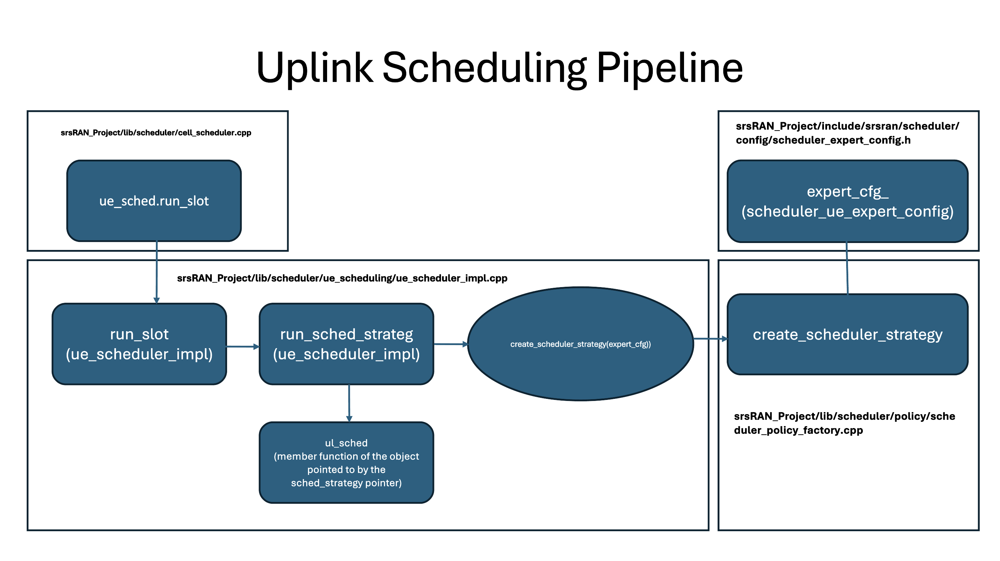
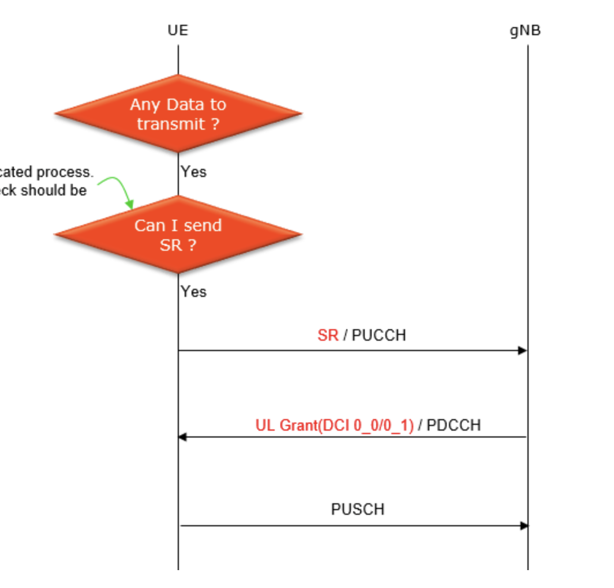

# Week of July 5-12 

This week I setup the srsRAN Project and figured out how we can perform UL scheduling.

## Installation
- srsRAN Project is a 5G CU/DU solution and does not include a UE application. However, srsRAN 4G does include a prototype 5G UE (srsUE) which can be used for testing. This application note shows how to create an end-to-end fully open-source 5G network with srsUE, the srsRAN Project gNodeB and Open5GS 5G core network. 
- Following the ZeroMQ installation note (linked [here](https://docs.srsran.com/projects/project/en/latest/tutorials/source/srsUE/source/index.html#zeromq-based-setup)) which requires me to install srsRAN 4G, Open5GS and the srsRAN Project.

**Installing srsRAN 4G from source, similar to my previous work.**

1. Installing the 'libzmq' and 'czmq' packages
```bash
$ sudo apt-get update
$ sudo apt-get install libzmq3-dev libczmq-dev
```

2. Building srsRAN 4G from source as described [here](https://docs.srsran.com/projects/4g/en/latest/app_notes/source/zeromq/source/index.html)
```bash
$ git clone https://github.com/srsRAN/srsRAN_4G.git
$ cd srsRAN_4G
$ mkdir build
$ cd build
$ cmake ../
$ make -j 20
```

**Installing Open5GS and dependent packages according to [this installation guide](https://open5gs.org/open5gs/docs/guide/01-quickstart/).**

3. Installing and Running MongoDB
- Proved to be slightly more difficult than expected considering I am using an Ubuntu 22.04 machine running on a Docker Container, so Tini is used as the init system (not systemcl). Figured out how to do the same with Tini.
```bash
# installing the public key used by the system
$ sudo apt update
$ sudo apt install gnupg
$ curl -fsSL https://pgp.mongodb.com/server-6.0.asc | sudo gpg -o /usr/share/keyrings/mongodb-server-6.0.gpg --dearmor
$ echo "deb [ arch=amd64,arm64 signed-by=/usr/share/keyrings/mongodb-server-6.0.gpg] https://repo.mongodb.org/apt/ubuntu jammy/mongodb-org/6.0 multiverse" | sudo tee /etc/apt/sources.list.d/mongodb-org-6.0.list
```

```bash
# installing the package and starting it
$ sudo apt update
$ sudo apt install -y mongodb-org
$ sudo tini -s -- /usr/bin/mongod --fork --config /etc/mongod.conf
```

- To ensure I did not have to do this every single time I started the system, I created two scripts: 
    - 'start_mongo.sh' : This script starts MongoDB with Tini.
    <br>
    ```bash
    #!/bin/bash
    /usr/bin/tini -s -- /usr/bin/mongod --fork --config /etc/mongod.conf
    ``` 
    - start_mongo : an init script that calls our previous script, and runs on startup of the machine.

    ```bash
    #!/bin/sh
    case "$1" in
        start)
            echo "Starting MongoDB"
            /usr/local/bin/start_mongo.sh
            ;;
        stop)
            echo "Stopping MongoDB"
            ;;
        restart)
            echo "Restarting MongoDB"
            /usr/local/bin/start_mongo.sh
            ;;
        *)
        echo "Usage: /etc/init.d/start_mongo {start|stop|restart}"
        exit 1
        ;;
    esac
    exit 0
    ``` 

Wrote these scripts and enabled their functionality using the following commands:
```bash
$ sudo nano /usr/local/bin/start_mongo.sh
$ sudo chmod +x /usr/local/bin/start_mongo.sh
$ sudo nano /etc/init.d/start_mongo
$ sudo chmod +x /etc/init.d/start_mongo
$ sudo update-rc.d start_mongo defaults
``` 
**Installing Open5GS**

4. Install the Open5GS package

```bash
$ sudo add-apt-repository ppa:open5gs/latest
$ sudo apt update
$ sudo apt install open5gs
``` 

5. Install the WebUI for Open5GS

```bash
# Download and import the Nodesource GPG key
 $ sudo apt update
 $ sudo apt install -y ca-certificates curl gnupg
 $ sudo mkdir -p /etc/apt/keyrings
 $ curl -fsSL https://deb.nodesource.com/gpgkey/nodesource-repo.gpg.key | sudo gpg --dearmor -o /etc/apt/keyrings/nodesource.gpg

 # Create deb repository
 $ NODE_MAJOR=20
 $ echo "deb [signed-by=/etc/apt/keyrings/nodesource.gpg] https://deb.nodesource.com/node_$NODE_MAJOR.x nodistro main" | sudo tee /etc/apt/sources.list.d/nodesource.list

 # Run Update and Install
 $ sudo apt update
 $ sudo apt install nodejs -y

 # Install the WebUI
 $ curl -fsSL https://open5gs.org/open5gs/assets/webui/install | sudo -E bash -
``` 

6. Installing the srsRAN Project

```bash
$ git clone https://github.com/srsran/srsRAN_Project.git
$ cd srsRAN_Project
$ mkdir build
$ cd build
$ cmake ../ -DENABLE_EXPORT=ON -DENABLE_ZEROMQ=ON
$ make -j`nproc`
```

**Ended up shifting to a new machine.**

## UL Scheduling Logic and Implementation



### Flow:

1. **File:** `cell_scheduler.cpp` 
   - **Location:** `srsRAN_Project/lib/scheduler/cell_scheduler.cpp`
   - **Key Function:** `ue_sched.run_slot`

2. **File:** `ue_scheduler_impl.cpp` 
   - **Location:** `srsRAN_Project/lib/scheduler/ue_scheduling/ue_scheduler_impl.cpp`
   - **Key Function:** `run_slot` 
   - **Details:** In the `run_slot` definition, `run_sched_strategy` is run every time. `run_slot` is a part of the class `ue_scheduler_impl`.

3. **File:** `ue_scheduler_impl.cpp` 
   - **Location:** `srsRAN_Project/lib/scheduler/ue_scheduling/ue_scheduler_impl.cpp`
   - **Key Function:** `run_sched_strategy` 
   - **Details:** For UL, executes a `ul_sched` method every runtime. `ul_sched` is a member function of the object pointed to by the `sched_strategy` pointer. 

4. **File:** `ue_scheduler_impl.cpp` 
   - **Location:** `srsRAN_Project/lib/scheduler/ue_scheduling/ue_scheduler_impl.cpp`
   - **Key Function:** `create_scheduler_strategy(expert_cfg)` 
   - **Details:** `run_sched_strategy` is populated with `create_scheduler_strategy(expert_cfg)`.

5. **File:** `scheduler_policy_factory.cpp` 
   - **Location:** `srsRAN_Project/lib/scheduler/policy/scheduler_policy_factory.cpp`
   - **Key Function:** `create_scheduler_strategy` 
   - **Details:** Scheduling strategy is decided using the object `expert_cfg_` of the class `scheduler_ue_expert_config`.

6. **File:** `scheduler_expert_config.h` 
   - **Location:** `srsRAN_Project/include/srsran/scheduler/config/scheduler_expert_config.h`
   - **Key Class:** `scheduler_ue_expert_config` 
   - **Details:** `rr` is defined as the default scheduling policy here (using `time_rr_scheduler_expert_config`).

7. **File:** `scheduler_expert_config.h` 
   - **Location:** `srsRAN_Project/include/srsran/scheduler/config/scheduler_expert_config.h`
   - **Key Classes:** `time_pf_scheduler_expert_config` and `time_pf_scheduler_expert_config` 
   - **Details:** Both are defined here.

### Scheduling Logic:
1. **Round Robin**

    A simple round robin implementation, where UE gets a chance to transmit one after the other.

- Functions of interest:
    1. ul_sched
        - Class: scheduler_time_rr
        - Defined File: scheduler_time_rr.cpp
        - Logic:
            - If there are no UEs to schedule, the function terminates.
            - If there exist UEs to schedule, the scheduling logic has three parts (in order):
                1. retransmitting old UL data
                2. pending scheduling requests (Find how this is done)
                3. transmitting new UL data
            - Each of these three logics is implemented within the 'ul_sched' function using Lambda Expressions ('data_retx_ue_function', 'sr_ue_function' and 'data_tx_ue_function'). The one thing in common each of these logics have is that they call the 'round_robin_apply' and 'alloc_ul_ue' functions.

    2. round_robin_apply
        - Function is defined as a template. Allows the function to accept any callable object (in the case, a lambda expression) to allocate resources to a UE.
        - Loops through all UEs, don't see how a weight based scheduling can be implemented here.

2. **Proportional Fair**

    A proportional fair implementation also exists, which can be found in the file 'scheduler_time_pf.cpp'. This is more of an implementation we can play around with, rather than the Round Robin one. Defined in 'scheduler_time_pf.cpp' file (srsRAN_Project/lib/scheduler/policy/scheduler_time_pf.cpp).
<br>

    #### Basic Logic:
    - The logic is based on a queue system. 
    - The queues are determined using the `compute_ul_prio` function.
    - Information from the UE at the top of the queue is taken, and then the `try_ue_alloc` function is called. 
    - UE allocation details are decided in the `compute_ul_prio` function. Here, other scheduling implementations, such as Max CQI, Max Weight, etc, can also be implemented. A priority function is involved, which seems to be another name for the weight variable we have been using.

    #### Priority Computation:
    1. Estimates the instantaneous UL rate using the `get_estimated_ul_rate` function.
    2. Retrieves the current average UL rate using the `ul_avg_rate` function. 
    3. Calculates the priority using a proportional fair formula:
        - priority = estimated_rate / (current_avg_rate ^ fairness_coefficient)
    4. If the current average rate is zero, sets priority to maximum if estimated rate is non-zero, or to zero otherwise.
    5. The fairness coefficient is defined using the `pf_sched_fairness_coeff` function. It is defined in the `scheduler_expert_config.h` file.

    #### Functions of Interest:

    1. `get_estimated_ul_rate`: Defined in `ue_cell.cpp` and used in `tbs_calculator.cpp`.
    2. `ul_avg_rate`    

## Scheduling Requests in 5G

### Overview
- Few Definitions:
    - _UL_ : UE to N/W
    - _DL_ : N/W to UE
    - _PUCCH (Physical Uplink Control Channel)_ is a UL Physical channel that is designed to carry UCI (Uplink Control Information). UCI messages support the scheduling of uplink shared channel (UL-SCH) transmissions. UCI can be carried either by PUCCH or PUSCH depending on the situation.
    - _PUSCH (Physical Uplink Shared Channel)_ is responsible for carrying **user data** from the UE to the network (gNB). Since it is a shared channel, multiple UEs can use the same physical resources for transmission, which are allocated dynamically by the gNB based on the network conditions and demand. This allocation is typically signaled through Downlink Control Information (DCI) sent over the PDCCH (Physical Downlink Control Channel).
    - _MCS (Modulation and Coding Scheme)_ decides both the modulation scheme and the coding rate.

- **Scheduling Request** is a way for a UE to tell the network that it has some data in its MAC buffer and it needs PHY resources in the Uplink direction to send that data. A SR is only triggered when the UE does not any have any UL resources scheduled, i.e, PUSCH resources. Refer to this [link](https://www.sharetechnote.com/html/5G/5G_SR.html).
- There are roughly two types of situations where SR is triggered. The use cases are:
    1. _Necessity-Based Use Case_: A UE triggers a SR when it has some data to transmit but has no UL grant from the network.
    2. _Periodicity-Based Use Case_: In this case, the UE triggers SR with a certain periodicity (specified in RRC) regardless of whether it has any data to send or not.
- Even though the SR message itself is a kind of physical layer message, it is controlled by a MAC layer process.



- *Negative vs Positive SR*: 
    - Positive SRs are sent when a UE requires an uplink transmission opportunity to send its buffered data to the network. Positive SR is crucial for efficient resource utilization, as it helps the gNB identify UEs with pending data and allocate resources accordingly.
    - Negative SRs occur when a UE does not have sufficient data in its buffers to transmit or when it determines the network conditions are not optimum for uplink transmission. An example of these types of SRs are SRs sent periodically, often ignoring the environment in which transmission occurs. 

*Why am I reading about this?*: We need to establish a benchmark of time taken from the start of the transmission across the PUCCH to the end of the transmission across the PUSCH.

# Week of July 15-22

Ran a 2 UE system and performed a few experiments to better understand scheduling and SRs in the srsRAN Project stack.

## Two UE Experiments

### Running Two UEs

- To connect multiple UEs to a single gNB using ZMQ-based RF devices, we require a broker that can both receive and process UL and DL signals. 
- We use **GNU-Radio Companion** to implement such a broker, as it allows easy integration with our ZMQ-based RF devices. More information about the setup can be found [here](https://docs.srsran.com/projects/project/en/latest/tutorials/source/srsUE/source/index.html#multi-ue-emulation).

#### Steps:
*Each step is executed in a seperate terminal. The Open5GS Core is already running. Kill and start the flowgraph each time you want to run the system.*

1. Run the GRC Flowgraph
```bash
$ cd /home/wcsng-32/gitrepos/EdgeRIC-Pulak
$ sudo -E python3 2ue-zmq-mode-23.04Mhz.py
```

2. Run gNB
```bash
$ cd /home/wcsng-32/gitrepos/EdgeRIC-Pulak/build/apps/gnb
$ sudo ./gnb -c zmq-mode-multi-ue.yml
```

3. Create network namespaces for both the UEs and run UE 1
```bash
$ cd /home/wcsng-32/gitrepos/EdgeRIC-5G/srsRAN_4G/build/srsue/src
$ sudo ./srsue ../../../.config/ue1-4g-zmq.conf
```

4. Run UE 2
```bash
$ cd /home/wcsng-32/gitrepos/EdgeRIC-5G/srsRAN_4G/build/srsue/src
$ sudo ./srsue ../../../.config/ue2-4g-zmq.conf
```

**Note:**
The Core Network runs using Open5GS at the destination IP Address: 10.45.0.1. We can just ping back and forth from that location.

5. Traffic Server
```bash
$ cd /home/wcsng-32/gitrepos/EdgeRIC-Pulak
$ ./traffic_2ues_ul_server.sh
```

6. Traffic Client
```bash
$ cd /home/wcsng-32/gitrepos/EdgeRIC-Pulak
$ ./traffic_2ues_ul_client.sh
```

## Plotting Metrics
### 1. Throughput

#### (Rough) Flow:

1. `ul_avg_rate()` function:
    - located in `srsRAN_Project/lib/scheduler/policy/scheduler_time_pf.cpp`
    - scheduler_time_pf.cpp (used) --> scheduler_time_pf.h (defined here) --> ul_avg_rate_ (after a checkpoint)

2. `ul_avg_rate_` variable:
    - located in `srsRAN_Project/lib/scheduler/policy/scheduler_time_pf.cpp`
    - initialised as 0 in `scheduler_time_pf.h`
    - later updated below. clearly, `alloc_bytes` is the variable we need
    ```bash
    void scheduler_time_pf::ue_ctxt::save_ul_alloc(uint32_t alloc_bytes)
    {
        if (ul_nof_samples < 1 / parent->exp_avg_alpha) {
        // Fast start before transitioning to exponential average.
        ul_avg_rate_ = ul_avg_rate_ + (alloc_bytes - ul_avg_rate_) / (ul_nof_samples + 1);
        } else {
        ul_avg_rate_ = (1 - parent->exp_avg_alpha) * ul_avg_rate_ + (parent->exp_avg_alpha) * alloc_bytes;
    }
    ul_nof_samples++;
    }
    ```    

3. `alloc_bytes` variable:
    - is actually just a local placeholder variable as are present in function definitions
    - stores data from `alloc_results.alloc_bytes`
    - `alloc_results` is defined below, and is dependent on `pusch_alloc.allocate_ul_grant(grant)` as defined in the `try_ul_alloc` function (located in the same file)
    ```bash
    if (ctxt.ul_newtx_h != nullptr) {
        grant.h_id                  = ctxt.ul_newtx_h->id;
        grant.recommended_nof_bytes = ues[ctxt.ue_index].pending_ul_newtx_bytes();
        alloc_result                = pusch_alloc.allocate_ul_grant(grant);
        if (alloc_result.status == alloc_status::success) {
          ctxt.ul_newtx_h = nullptr;
        }
    return alloc_result;
    }
    if (ctxt.ul_newtx_h != nullptr) {
        grant.h_id                  = ctxt.ul_newtx_h->id;
        grant.recommended_nof_bytes = ues[ctxt.ue_index].pending_ul_newtx_bytes();
        alloc_result                = pusch_alloc.allocate_ul_grant(grant);
        if (alloc_result.status == alloc_status::success) {
            ctxt.ul_newtx_h = nullptr;
        }
    return alloc_result;
    }
    ```  
    - **The `try_ul_alloc` function ensures the `alloc_results` class is populated with the output of `pusch_alloc.allocate_ul_grant(grant)`**

4. `pusch_alloc.allocate_ul_grant(grant)` function:
    - located in `srsRAN_Project/lib/scheduler/ue_scheduling/ue_cell_grid_allocator.cpp`
    - uses a function `compute_ul_mcs_tbs` to calculate the UL throughput per slot.
    
5. `compute_ul_mcs_tbs` function:    
    - the function definition is located in `srsRAN_Project/lib/scheduler/support/mcs_tbs_calculator.cpp`

#### Bottomline
Edit accordingly.
```bash
alloc_result alloc_result = {alloc_status::invalid_params};
    while (not ul_queue.empty()) {
        ue_ctxt& ue = *ul_queue.top();
        if (alloc_result.status != alloc_status::skip_slot) {
            alloc_result = try_ul_alloc(ue, ues, pusch_alloc);
        }
        //[PULAK] log using the rnti of this UE along with the alloc_bytes variable
        ue.save_ul_alloc(alloc_result.alloc_bytes);
        // Re-add the UE to the queue if scheduling of re-transmission fails so that scheduling of retransmission are
        // attempted again before scheduling new transmissions.
        if (ue.ul_retx_h != nullptr and alloc_result.status == alloc_status::invalid_params) {
            ul_queue.push(&ue);
        }
        ul_queue.pop();
```    


### 2. SNR
#### (Rough) Flow:

1. `get_effective_snr()`
    - located in `srsRAN_Project/lib/scheduler/ue_scheduling/ue_link_adaptation_controller.cpp`
    - defined as below, uses the `ue_ch_st.get_pusch_snr()` as the base
    ```bash
    float ue_link_adaptation_controller::get_effective_snr() const
    {
        return ue_ch_st.get_pusch_snr() + (ul_olla.has_value() ? ul_olla.value().offset_db() : 0.0f);
    }
    ```

2. `ue_ch_st.get_pusch_snr()`
    - located in the `srsRAN_Project/lib/scheduler/ue_scheduling/ue_link_adaptation_controller.cpp`
    - simply returns another variable `pusch_snr_db` as the result
    - as we see here, `pusch_snr_db` is simply populated with the results of `expert_cfg.initial_ul_sinr`
    ```bash
    ue_channel_state_manager::ue_channel_state_manager(const scheduler_ue_expert_config& expert_cfg, unsigned nof_dl_ports_) :
    // Initialization
    nof_dl_ports(nof_dl_ports_), pusch_snr_db(expert_cfg.initial_ul_sinr), wideband_cqi(expert_cfg.initial_cqi)
    ```

3. `scheduler_ue_expert_config.initial_ul_sinr`
    - private variable part of the `scheduler_ue_expert_config`
    - located in `srsRAN_Project/include/srsran/config/scheduler_expert_config.h`
    - seems to be defined somewhere, can't find how this value is set/defined. *[USHASI'S INPUT NEEDED]*

#### Bottomline
Define a function which creates an object of class `ue_link_adaptation_controller` using which we can call the function `get_effective_snr()`. *How will this work slot-wise and UE-wise? Not sure if this is the right one.*     

# Week July 23-August 2

Spent some time understanding C++ code and debugging C++ using VSCode. Also, tried to understand the variables and functions in use a little better. Helped me log metrics and decide how to implement further scheduling schemes.

## PF File (`srsRAN_Project/lib/scheduler/policy/scheduler_time_pf.cpp`)
### Functions and Variables of Interest
1. `ue_history_db`
    - Data Type: std::map<uint16_t, ue_ctxt>
    - Key is a uint16_t (`ue_index`) representing the unique index or ID of a UE, and the value is an instance of ue_ctxt, which holds the context information for that UE. 
    - `ue_history_db` keeps track of all UEs that have been scheduled.

2. `it`
    - iterator used to access every member of `ue_history_db`
    - `it->ue_index` is used to access the key
    ```bash
    for (auto it = ue_history_db.begin(); it != ue_history_db.end();) {
        if (not ues.contains(it->ue_index)) {
        ue_history_db.erase(it->ue_index);
        }
        ++it;
    }
    ```

3. `ues`
    - likely contains all currently connected UEs

4. `ctxt`
    - reference of the `ue_ctxt` object, contains information about a specific UE (chosen using the UE Index).

5. `try_ul_alloc`
    - *how do you find the final UE which transmits in a slot finally?*

6. `ue.save_ul_alloc(alloc_result.alloc_bytes)`
    - effectively updates the estioated rate

7. `ue_ctxt`
    - contains information about the UE

8. **`compute_ul_prio`**
    - **This is the function to be edited to implement different types of scheduling algorithms.**
    - how often is ul_prio used? - in a slot, once for every UE to be scheduled in that slot
    - Functions/Files of Interest:
        - Class `ue_cell`:
            - defined in `srsRAN_Project/lib/scheduler/ue_scheduling/ue_cell.h`. Check comments for more information.
            - used in `srsRAN_Project/lib/scheduler/ue_scheduling/ue_cell.cpp`
            - has a attribute called `rnti` --> access using `rnti_t my_rnti = ue_cell_object.rnti();`.
            - has 
        - File `srsRAN_Project/lib/scheduler/config/ue_configuration.h`:
            - has two classes `ue_cell_configiration` and `ue_configiration` that contains information about the UE (especially the cell and realted information) for the given scheduling round.

### (Rough) Flow
1. `ue_scheduler.run_slot(...)`:
    - called in `srsRAN_Project/lib/scheduler/cell_scheduler.cpp`
    - defined in `srsRAN_Project/lib/scheduler/ue_scheduling/ue_scheduler.h` and `srsRAN_Project/lib/scheduler/ue_scheduling/ue_scheduler_impl.cpp`

2. `run_slot(slot_point slot_tx, du_cell_index_t cell_index)`:
    - located in `srsRAN_Project/lib/scheduler/ue_scheduling/ue_scheduler_impl.cpp`
    - calls `run_sched_strategy(...)` which is located in the same file. This function eventually calls `ul_sched`

3. `ul_sched(ue_alloc, ue_res_grid_view, ue_db)`:
    - located in `srsRAN_Project/lib/scheduler/policy/scheduler_time_pf.cpp`.
    - finally!!!

# Logging Metrics

For some reason, initially my setup didn't seem to be working. Rebuilding the srsRAN Project with the appropriate ZMQ and Debugging hooks. Using the below commands to rebuild my system.

```bash
    rm -rf build
    make clean
    cmake -DENABLE_EXPORT=ON -DENABLE_ZEROMQ=ON -DCMAKE_BUILD_TYPE=Debug ..
    make -j1
```

