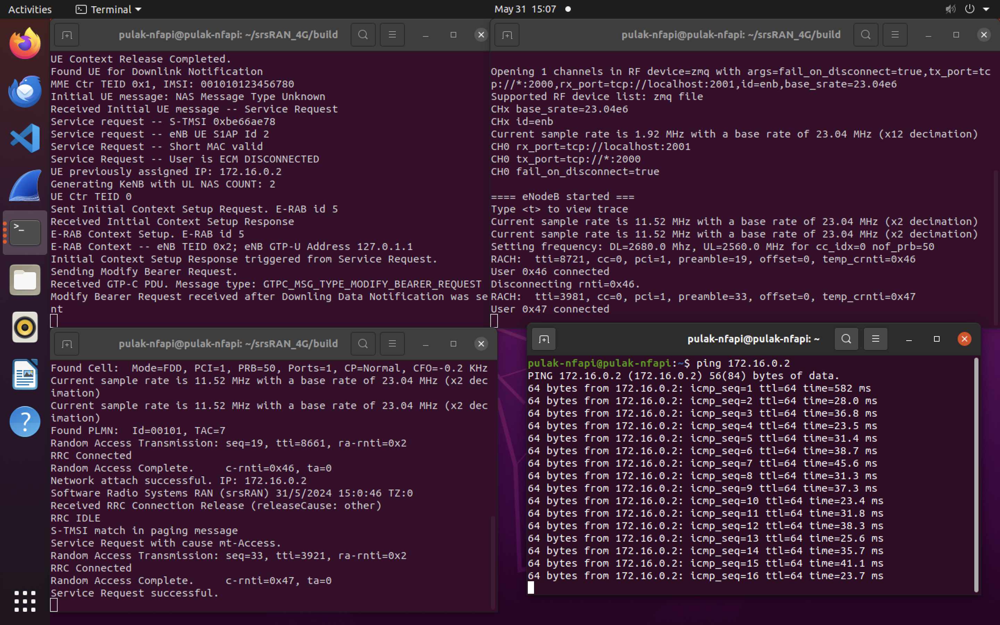
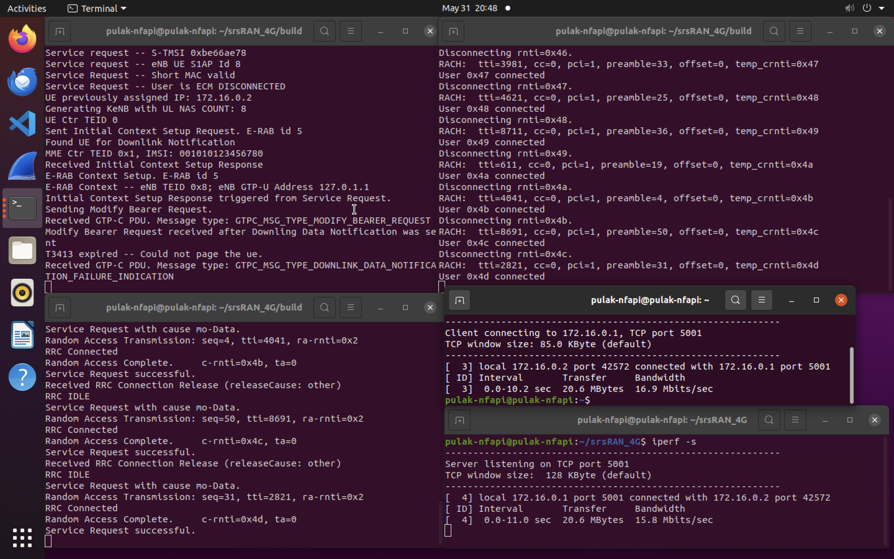
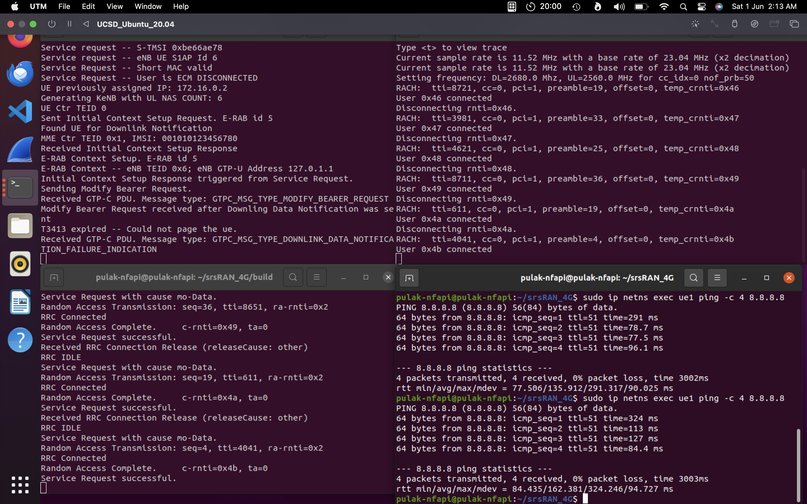

# srsRAN Project Tracker - Pulak Mehrotra

A tracker used to both track my understanding of the softwares I am implementing, as well as the results/progress of my implementations.

## Background
- srsRAN 4G is a 4G and 5G software radio suite, which consists of the LTE Core Network (EPC), a eNodeB (Base Station) and a UE.
- Supports only a single UE and a single eNB in a system.
- While performing an end-to-end LTE simulation using srsRAN, it is important to ensure that both the EPC and the UE are working on different isolated network environments, but on the same machine. By assigning the UE and EPC different namespaces, we ensure that they have separate network stacks, including their own IP addresses, routing tables, and interfaces.
- This isolation is crucial to avoid conflicts between the network and port configurations of the UE and EPC, which might otherwise interfere with each other if they were in the same namespace.
- Now, the communication between these two simulations is analogous to network layer communication, achieved using TUN interfaces. A TUN (network TUNnel) interface simulates a network layer device and operates at layer 3, carrying TCP/IP packets in this context.
```
                                            +-----+       +-----+       +----+
                                            | EPC | <-->  | eNB | <-->  | UE |
                                            +-----+       +-----+       +----+

```
- Usually, both the eNB and the UE use physical radios for communication. In this simulation, we use the ZeroMQ library to simulate virtual radios.

## Progress  

### Built the srsRAN from source  
- Built the dependent ZeroMQ development libraries from source as well.
- Built onto a UTM Linux VM running Ubuntu 20.04. The machine itself has 4 GB RAM allocated, along with ~ 50 GB of storage.
- Package built without errors and passed all 1407 tests successfully.

|  |  |
|:-------------------------------------------:|:----------------------------------------------:|
| Finished Build                              | Tests Passed                                   |

<br>

### LTE Network Simulation
- Successfully executed a simulation that established a connection between a LTE EPC and a UE using ZeroMQ Virtual Radios.
- Successfully sent both UL and DL traffic using the ping command.

|  |  |
|:--------------------------------------------------:|:--------------------------------------------------:|
|                   UL Traffic Ping                   |                   DL Traffic Ping                   |

<br>

- Conducted similar tests for traffic generated using iperf.

<table style="width: 100%; border: none; margin: 0; padding: 0;">
  <tr style="border: none; margin: 0; padding: 0;">
    <td style="border: none; text-align: center; margin: 0; padding: 0;">
      
    </td>
  </tr>
</table>

<br>

- Connected the UE to the Internet and verified the connection by transmitting packets from a well known public Internet server (Google's Public DNS Server)

<table style="width: 100%; border: none; margin: 0; padding: 0;">
  <tr style="border: none; margin: 0; padding: 0;">
    <td style="border: none; text-align: center; margin: 0; padding: 0;">
      
    </td>
  </tr>
</table>

<br>

## Code

### Enabling Connections

1. **Terminal 1 (EPC)**

    ```bash
    #assuming you are in the srsRAN_4G/build folder
    sudo ./srsepc/src/srsepc
    ```

2. **Terminal 2 (eNB)**

    ```bash
    sudo ./srsenb/src/srsenb --rf.device_name=zmq --rf.device_args="fail_on_disconnect=true,tx_port=tcp://*:2000,rx_port=tcp://localhost:2001,id=enb,base_srate=23.04e6"
    ```

So, the transmitting IP address and port are `*:2000` (binds to all available interfaces), and the receiving IP address and port are `127.0.0.1:2001` (loopback interface).

3. **Terminal 3 (UE)**

    ```bash
    #create a seperate network namespace for the UE simulator to run
    sudo ip netns add ue1
    sudo ./srsue/src/srsue --rf.device_name=zmq --rf.device_args="tx_port=tcp://*:2001,rx_port=tcp://localhost:2000,id=ue,base_srate=23.04e6" --gw.netns=ue1
    ```

Similarly, the transmitting IP address and port is `*:2001`, and the receiving IP address and port are `127.0.0.1:2000`.

### Traffic Generation

1. **Using the 'ping' command**

    *Terminal 4*

    ```bash
    # downlink traffic
    ping 172.16.0.2
    # uplink traffic
    sudo ip netns exec ue1 ping 172.16.0.1
    ```

2. **Using 'iperf'**

    *Terminal 4 (Server)*

    ```bash
    iperf -s
    ```

    *Terminal 5 (Client)*

    ```bash
    sudo ip netns exec ue1 ping -c 4 8.8.8.8
    ```

### Connecting the UE to the Internet
To connect the UE to the Internet, run the masquerading script located in the `srsRAN_4G/srsepc` folder. The `masquerading_script.sh` enables IP masquerading, which allows the UE to access the Internet through the EPC.

  ```bash
    sudo ./srsRAN_4G/srsepc/masquerading_script.sh
  ```

### Commands for Connection Verification

```bash
# checks network interfaces within the ue1 namespace
sudo ip netns exec ue1 ip link

# checks IP addresses in the ue1 namespace
sudo ip netns exec ue1 ip addr

# modifies routing table in the ue1 namespace
sudo ip netns exec ue1 ip route
sudo ip netns exec ue1 ip route add default via 172.16.0.1 dev tun_srsue

# tests internet connectivity in the ue1 namespace
sudo ip netns exec ue1 ping -c 4 8.8.8.8
```
