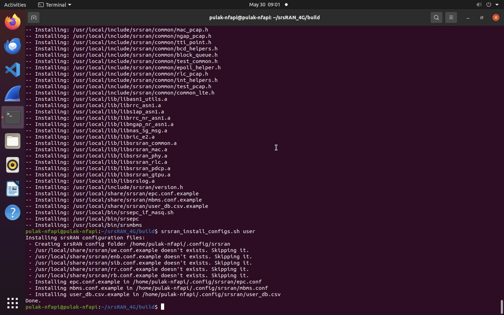
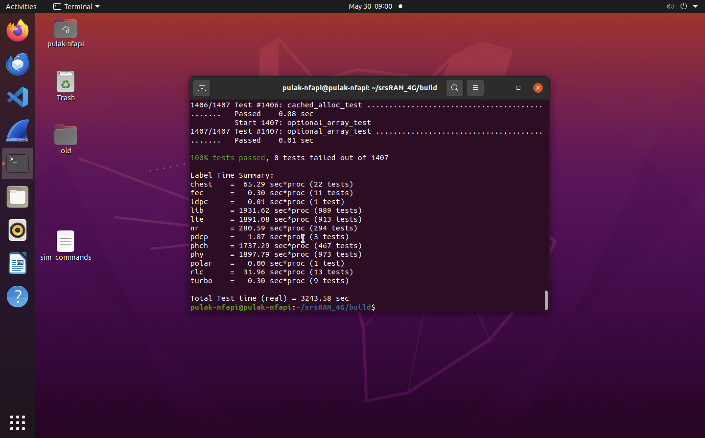

# UCSD Project Tracker - Pulak Mehrotra

A tracker used to both track my understanding of the softwares I am implementing, as well as the results/progress of my implementations.

## srsRAN 4G

**Background:**
- srsRAN 4G is a 4G and 5G software radio suite, which consists of the LTE Core Network (EPC), a eNodeB (Base Station) and a UE.
- Supports only a single UE and a single eNB in a system.
- While performing an end-to-end LTE simulation using srsRAN, it is important to ensure that both the EPC and the UE are working on different isolated network environments, but on the same machine. By assigning the UE and EPC different namespaces, we ensure that they have separate network stacks, including their own IP addresses, routing tables, and interfaces.
- This isolation is crucial to avoid conflicts between the network and port configurations of the UE and EPC, which might otherwise interfere with each other if they were in the same namespace.
- Now, the communication between these two simulations is analogous to network layer communication, achieved using TUN interfaces. A TUN (network TUNnel) interface simulates a network layer device and operates at layer 3, carrying TCP/IP packets in this context.
- 

<div style="text-align: center;">
  <div class="mermaid">
    graph LR;
        EPC <--> eNB <--> UE;
  </div>
</div>

- Usually, both the eNB and the UE use physical radios for communication. In this simulation, we use the ZeroMQ library to simulate virtual radios.

**Progress:**  
- Built the srsRAN from source  
    - Built the dependent ZeroMQ development libraries from source as well.
    - Built onto a UTM Linux VM running Ubuntu 20.04. The machine itself has 4 GB RAM allocated, along with ~ 50 GB of storage.
    - Package built without errors and passed all 1407 tests successfully.
    
<div style="display: flex; justify-content: center; gap: 5px; margin: 0; padding: 0;">
  
  
</div>
<br>

- Ran an end-to-end simulation of a connection between a LTE EPC and a UE
<div style="display: flex; justify-content: center; gap: 5px; margin: 0; padding: 0;">
  
  
</div>

<br>

**Code to Enable Connections:**

1. **Terminal 1 (EPC)**

    ```bash
    #assuming you are in the srsRAN_4G/build folder
    sudo ./srsepc/src/srsepc
    ```

2. **Terminal 2 (eNB)**

    ```bash
    sudo ./srsenb/src/srsenb --rf.device_name=zmq --rf.device_args="fail_on_disconnect=true,tx_port=tcp://*:2000,rx_port=tcp://localhost:2001,id=enb,base_srate=23.04e6"
    ```

So, the transmitting IP address and port are `*:2000` (binds to all available interfaces), and the receiving IP address and port are `127.0.0.1:2001` (loopback interface).

3. **Terminal 3 (UE)**

    ```bash
    #create a seperate network namespace for the UE simulator to run
    sudo ip netns add ue1
    sudo ./srsue/src/srsue --rf.device_name=zmq --rf.device_args="tx_port=tcp://*:2001,rx_port=tcp://localhost:2000,id=ue,base_srate=23.04e6" --gw.netns=ue1
    ```

Similarly, the transmitting IP address and port is `*:2001`, and the receiving IP address and port are `127.0.0.1:2000`.

4. **Terminal 4 (Traffic Generation)**

    ```bash
    #downlink traffic
    ping 172.16.0.2
    #uplink traffic
    sudo ip netns exec ue1 ping 172.16.0.1
    ```

**Code to connect the UE to the Internet**
To connect the UE to the Internet, run the masquerading script located in the `srsRAN_4G/srsepc` folder. The `masquerading_script.sh` enables IP masquerading, which allows the UE to access the Internet through the EPC.

    ```bash
    sudo ./srsRAN_4G/srsepc/masquerading_script.sh
    ```
## Additional Notes

- The `masquerading_script.sh` enables IP masquerading, which allows the UE to access the Internet through the EPC.

The output from `sudo ip netns exec ue1 ip link` shows the network interfaces within the network namespace `ue1`. Here’s a breakdown of what each line means:

### Network Namespace `ue1` Interfaces

1. **lo (Loopback Interface)**
   ```
   1: lo: <LOOPBACK> mtu 65536 qdisc noop state DOWN mode DEFAULT group default qlen 1000
       link/loopback 00:00:00:00:00:00 brd 00:00:00:00:00:00
   ```

   - **Interface Number and Name**: `1: lo`
   - **Flags**: `<LOOPBACK>`
     - **LOOPBACK**: Identifies this as a loopback interface.
   - **MTU (Maximum Transmission Unit)**: `65536`
   - **Qdisc (Queueing Discipline)**: `noop` (no queuing)
   - **State**: `DOWN` (interface is not active)
   - **Mode**: `DEFAULT`
   - **Group**: `default`
   - **Queue Length**: `1000`
   - **MAC Address**: `00:00:00:00:00:00` (standard for loopback)

2. **tun_srsue (TUN Interface)**
   ```
   2: tun_srsue: <POINTOPOINT,MULTICAST,NOARP,UP,LOWER_UP> mtu 1500 qdisc fq_codel state UNKNOWN mode DEFAULT group default qlen 500
       link/none
   ```

   - **Interface Number and Name**: `2: tun_srsue`
   - **Flags**:
     - **POINTOPOINT**: Point-to-point interface.
     - **MULTICAST**: Supports multicast.
     - **NOARP**: No Address Resolution Protocol.
     - **UP**: Interface is up.
     - **LOWER_UP**: The lower layers (e.g., physical layer) are up.
   - **MTU (Maximum Transmission Unit)**: `1500`
   - **Qdisc (Queueing Discipline)**: `fq_codel` (Fair Queue Controlled Delay)
   - **State**: `UNKNOWN` (may indicate a lack of carrier signal detection, typical for TUN/TAP interfaces)
   - **Mode**: `DEFAULT`
   - **Group**: `default`
   - **Queue Length**: `500`
   - **Link**: `none` (TUN interfaces do not have a physical link layer address)

### Explanation

- **Loopback Interface (`lo`)**: The loopback interface is used for network communication within the device itself. It’s common to see it in a `DOWN` state in certain network namespaces where it’s not actively used.

- **TUN Interface (`tun_srsue`)**: This is a TUN (network TUNnel) interface created by srsUE (the UE component of srsRAN). TUN interfaces are virtual network kernel interfaces that are used to create point-to-point network tunnels. They operate at the network layer (Layer 3) and are typically used to route IP packets.

### What to Do Next

1. **Check Connectivity**:
   - Ensure that the TUN interface `tun_srsue` is properly configured to route traffic.
   - Use `sudo ip netns exec ue1 ip addr` to check the IP addresses assigned to the interfaces.
   - Use `sudo ip netns exec ue1 ping -c 4 8.8.8.8` to test connectivity to an external IP.

2. **Verify Routing**:
   - Use `sudo ip netns exec ue1 ip route` to check the routing table and ensure there’s a default route pointing to the gateway provided by the EPC.

3. **Check Interface Status**:
   - Ensure the interface status is correct. If `tun_srsue` is `UNKNOWN`, it’s often acceptable for virtual interfaces. Ensure that packets can still be transmitted and received.

### Example Commands for Verification

```bash
# Check IP addresses in the ue1 namespace
sudo ip netns exec ue1 ip addr

# Check routing table in the ue1 namespace
sudo ip netns exec ue1 ip route

# Test internet connectivity in the ue1 namespace
sudo ip netns exec ue1 ping -c 4 8.8.8.8

# Fetch a webpage to test full internet access in the ue1 namespace
sudo ip netns exec ue1 curl http://www.google.com
```

These steps will help ensure that your UE has the proper network setup and can communicate with the internet. If there are issues, examining the configurations and logs for each component (
